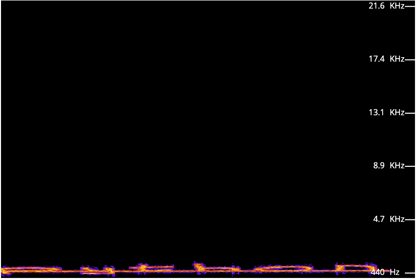
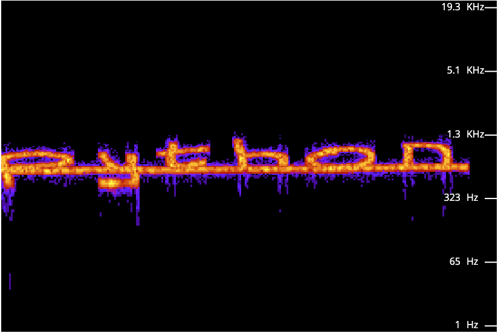

```
Use some stego skills to retrieve the flag!
```
We see that the text file says `If I want to get the password, I'll have to face the music`. From this, we get 2 things:
1. The picture has a file hidden inside, with a pasword
2. The password is hidden in the audio file

Since the the audio file is a .wav we can open it with sonic visualizer, or [this online tool](https://academo.org/demos/spectrum-analyzer/)
When we open it up, and play the file, we see

but that is quite hard to read, so we put it in logarithmic mode, and we see

