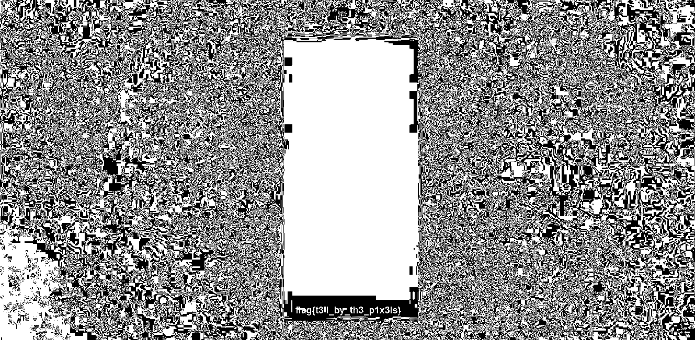

```
The mysterious artist Zima has unveiled his latest piece, and once again, it features his signature shade of blue.
I honestly don't get it. Is he hiding a message in his art somehow?

```
Using [this website](https://stegonline.georgeom.net/image) we can browse bit planes. Scrolling through all the planes, we can make out the flag in Green 1 the best.


the flag is `flag{t3ll_by_th3_p1x3ls}`
